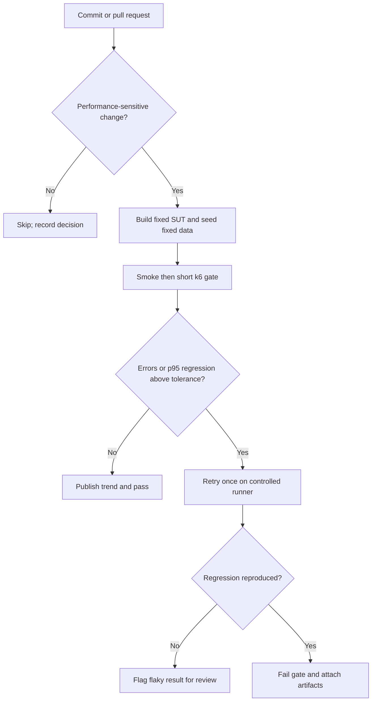

# HW05 — Performance Testing Report

Student ID: `23127194`  
Toolchain: k6 + Grafana + macOS resource monitor  
Execution date: TODO

## 1. Executive summary

TODO: Summarize the three scenarios, stable threshold, major bottleneck, issue count, and evidence links.

## 2. SUT and environment

### 2.1 Version under test

- Repository and commit: TODO
- Backend command/configuration: TODO
- Dataset size and database state: TODO

### 2.2 Hardware

| Item | Value | Evidence |
| --- | --- | --- |
| Hostname | TODO | TODO |
| CPU | TODO | TODO |
| RAM | TODO | TODO |
| OS | TODO | TODO |
| Storage | TODO | TODO |

## 3. AI-assisted design and human review

### 3.1 Endpoint-to-scenario mapping

Use the approved mapping from `PLAN.md` and add non-duplication confirmation.

### 3.2 Workload and threshold rationale

TODO: For each scenario, state hypothesis, calibration evidence, stages/rate, think time, checks, thresholds, and why values are realistic on this hardware.

### 3.3 Human corrections to AI plans

| Scenario | AI mistake/omission | Human correction | Why AI missed it | Evidence |
| --- | --- | --- | --- | --- |
| Load | TODO | TODO | TODO | TODO |
| Stress | TODO | TODO | TODO | TODO |
| Spike | TODO | TODO | TODO | TODO |

## 4. Execution and results

For each scenario include: exact command, final plan/CSV, raw output, report view, resource screenshot, metric table, observations, and pass/fail decision.

### 4.1 Load — read-heavy

TODO

### 4.2 Stress — auth-heavy

TODO

### 4.3 Spike — transactional

TODO

### 4.4 Account-lockout handling

TODO: Record the isolated preflight and exact reset/wait procedure. Note the implementation/spec discrepancy if reproduced.

## 5. Endurance threshold

| Metric | Stable value | Failure ceiling/limit | Raw source |
| --- | ---: | ---: | --- |
| Sustained RPS | TODO | TODO | TODO |
| p95 | TODO | TODO | TODO |
| Error rate | TODO | TODO | TODO |
| Memory | TODO | TODO | TODO |
| CPU | TODO | TODO | TODO |

TODO: Define “stable” and explain how the threshold was derived from the 10–15 minute run.

## 6. AI analysis and misinterpretation hunt

| AI claim | Correct raw value | Why the claim is wrong | Corrected interpretation | Raw citation |
| --- | ---: | --- | --- | --- |
| TODO | TODO | TODO | TODO | TODO |

### 6.1 Optimization feasibility

| AI recommendation | Feasible / conditional / hallucinated | Source-based reasoning | Expected trade-off |
| --- | --- | --- | --- |
| TODO | TODO | TODO | TODO |

## 7. Genuine issues

TODO: Link GitHub issues and screenshots, or state that no genuine issue was observed.

## 8. Continuous Performance Testing proposal

TODO: Define sensitive paths, baseline window, p95 tolerance, minimum samples, retry policy, scheduled full suite, cost, and false-alarm trade-offs.

## 9. Conclusion

TODO

## Appendices

- A. AI Audit Report
- B. 200–300 word AI Critique
- C. Git commit log
- D. Demo video and Agent Skill demonstration
