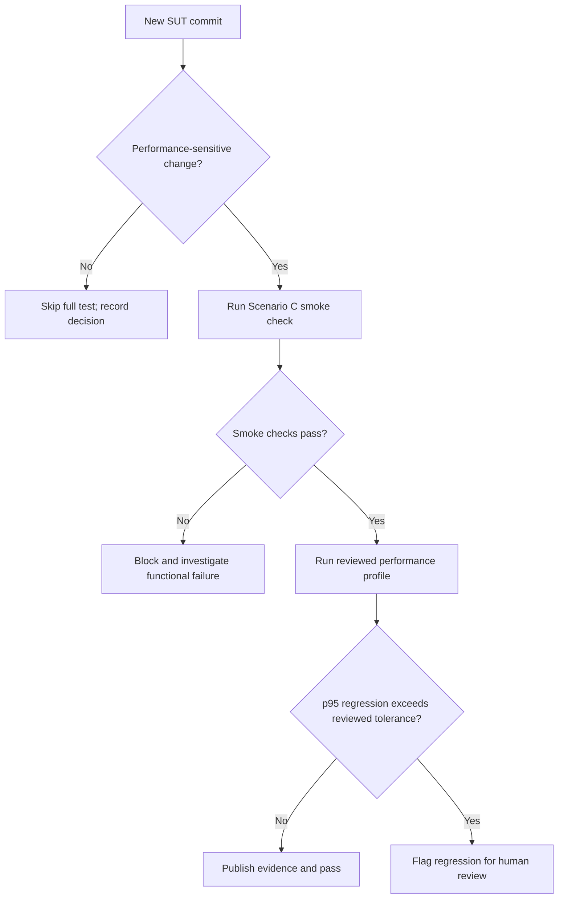

# Continuous Performance Testing Proposal

## Decision flow

Replace the conditions below with reviewed project rules.

## Trigger rules

- TBD: backend/database/auth/order changes
- TBD: scheduled baseline/endurance cadence
- TBD: documentation-only exclusions

## Regression policy

- Baseline source: TBD
- p95 comparison method: TBD
- Minimum sample/run stability: TBD
- Absolute and relative tolerance: TBD
- Human override and audit trail: TBD

## Trade-offs

| Topic | Benefit | Cost / false-alarm risk | Mitigation |
| --- | --- | --- | --- |
| Per-commit performance run | TBD | TBD | TBD |
| Scheduled run | TBD | TBD | TBD |
| Shared test environment | TBD | TBD | TBD |
| p95 regression gate | TBD | TBD | TBD |
