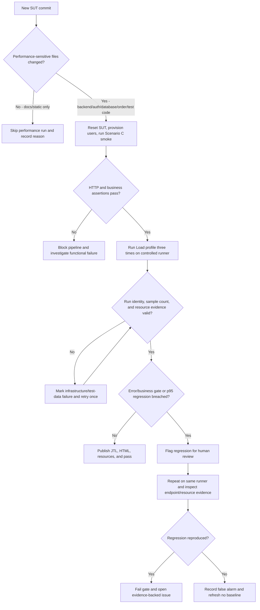

# Continuous Performance Testing Proposal

## Decision flow

## Trigger rules

- On each pull request, run the smoke check when changes touch backend API, authentication, database schema/queries, cart/order logic, JMeter plans, provisioning, or measured-run scripts.
- After the smoke check, run the Load profile for performance-sensitive changes. Documentation-only, image-only, or unrelated homework changes may skip it, but the pipeline records the matched exclusion rule.
- Run Stress and Spike on a nightly or pre-release schedule because their cost and machine disturbance are higher than Load.
- Run the 12-minute Endurance profile weekly and before a release candidate on the same controlled hardware class.
- Never compare results across different JMeter plans, run identities, account pools, database states, or hardware classes.

## Regression policy

- Baseline source: the median of the latest five accepted Load runs for the same Scenario C plan, hardware class, JMeter version, database seed, and workload contract. Load Run02 is seed evidence, not by itself a statistically stable CI baseline.
- Run method: execute three valid repetitions after reset/provisioning and compare the median end-to-end p95 and transaction p95 values with the accepted rolling baseline.
- Hard correctness gates: HTTP error rate must remain at or below 1% and business success at or above 99%. Any assertion/correlation failure blocks acceptance independently of latency.
- Regression flag: raise human review when median end-to-end p95 increases by more than 20% and at least 10 ms over baseline, or exceeds the proposed local diagnostic guard of 75 ms. This is a project gate, not a production SLO.
- Stability requirements: all three repetitions must use complete, untouched JTL files; identical workload settings; sufficient account capacity; and attributable same-run evidence. Invalid/malformed resource evidence prevents a resource conclusion but does not alter JTL latency values.
- Confirmation: repeat a flagged run once on the same controlled runner. Fail the gate only when the regression reproduces or when a hard correctness gate fails.
- Human override: requires a written reason, affected metric, source JTL paths, commit SHA, approver, and expiry/retest condition. An override never rewrites the baseline automatically.

## Trade-offs

| Topic | Benefit | Cost / false-alarm risk | Mitigation |
| --- | --- | --- | --- |
| Per-commit smoke and Load | Detects regressions near the responsible change | Adds several minutes and account/database setup to relevant pull requests | Path-based triggers, docs-only exclusions, dependency caching, and cancellation of superseded runs |
| Nightly Stress/Spike | Finds concurrency and recovery changes without blocking every commit | More CPU time; concurrent jobs can distort results | Dedicated runner, serialized jobs, fixed seed, and one confirmation rerun |
| Weekly Endurance | Detects sustained throughput or memory-trend changes | At least 12 minutes per repetition and sensitivity to background activity | Fixed hardware class, scheduled quiet window, resource capture, and trend review rather than a single hard memory ceiling |
| Shared test environment | Reduces infrastructure cost | Other workloads, stale database state, and network jitter create false alarms | Prefer isolated runner/SUT; otherwise lock the environment, reset state, and reject overlapping runs |
| Relative p95 gate | Adapts as the implementation improves | Tiny baselines can make small absolute changes look large | Require both greater than 20% and at least 10 ms, plus a confirmation run |
| Rolling baseline | Reflects accepted system evolution | A slow regression can gradually contaminate the baseline | Update only from accepted runs and retain a fixed release baseline for long-term comparison |

## Published artifacts and retention

Each CI execution publishes the plan identity, commit SHA, environment fingerprint, untouched JTL, generated HTML dashboard, resource samples, assertion verdicts, and comparison result. Keep pull-request Load evidence for at least 30 days and release/nightly evidence for the project lifetime. A failed or invalid attempt remains traceable but is never merged with its replacement run.
